# Lab 01: PostgreSQL Docker Setup and Basic Operations

## วัตถุประสงค์
1. ติดตั้งและใช้งาน PostgreSQL ผ่าน Docker
2. อธิบายโครงสร้างพื้นฐานของ PostgreSQL Database Cluster
3. สร้าง และจัดการ Database และ User
4. ใช้ Docker Volume เพื่อความคงทนของข้อมูล


## ทฤษฎีก่อนการทดลอง

### 1. Database Cluster Architecture

PostgreSQL Database Cluster คือกลุ่มของฐานข้อมูลที่ถูกบริหารจัดการโดย PostgreSQL server หนึ่งตัว โครงสร้างประกอบด้วย:

#### Logical Structure
- **Database Cluster**: กลุ่มของฐานข้อมูลที่ถูกบริหารโดย PostgreSQL server หนึ่งตัว
- **Database**: การแยกแยะข้อมูลเป็นกลุ่มที่เกี่ยวข้องกัน แต่ละฐานข้อมูลมีชื่อที่ไม่ซ้ำกัน
- **Schema**: คือ namespace ที่ประกอบด้วย tables, views, indexes, functions, stored procedures
- **Tables/Objects**: วัตถุต่างๆ ในฐานข้อมูลที่เก็บข้อมูลจริง

#### Physical Structure
- **Tablespace**: ตำแหน่งบนดิสก์ที่ใช้เก็บไฟล์ข้อมูล (default: pg_default และ pg_global)
- **Data Directory**: โฟลเดอร์หลักที่เก็บไฟล์ทั้งหมดของ database cluster
- **WAL (Write-Ahead Log)**: ไฟล์บันทึกการเปลี่ยนแปลงเพื่อการ recovery

### 2. PostgreSQL Memory Architecture

#### Shared Memory Components
- **Shared Buffers**: หน่วยความจำส่วนกลางสำหรับแคชข้อมูล (ควรเป็น 25% ของ RAM)
- **WAL Buffers**: พื้นที่เก็บ Write-Ahead Log ก่อนเขียนลงดิสก์
- **CLog Buffer**: เก็บรายการ transaction ที่ทำงานอยู่

#### Process Memory Components
- **Work Memory**: หน่วยความจำสำหรับการ sort และ hash operations
- **Maintenance Work Memory**: ใช้สำหรับงาน maintenance เช่น VACUUM, REINDEX

### 3. Docker และ Volume Management

#### Docker Benefits
- **Isolation**: แยกสภาพแวดล้อมจากระบบหลัก
- **Consistency**: สภาพแวดล้อมเหมือนกันทุกเครื่อง
- **Easy Management**: ง่ายต่อการติดตั้ง backup และ restore
- **Version Control**: จัดการหลายเวอร์ชันได้ง่าย

#### Docker Volume Types
- **Named Volumes**: จัดการโดย Docker, เหมาะสำหรับ production
- **Bind Mounts**: เชื่อมโฟลเดอร์จากระบบโดยตรง
- **tmpfs Mounts**: เก็บข้อมูลใน memory (ไม่คงทน)

### 4. User และ Role Management

#### PostgreSQL Security Model
- **Roles**: ผู้ใช้งานหรือกลุ่มผู้ใช้งาน
- **Privileges**: สิทธิ์ในการเข้าถึงวัตถุต่างๆ
- **Authentication**: การยืนยันตัวตน
- **Authorization**: การควบคุมสิทธิ์การเข้าถึง

## การเตรียมความพร้อม

### ติดตั้ง Docker
```bash
# สำหรับ Windows/Mac: ดาวน์โหลด Docker Desktop
# สำหรับ Linux (Ubuntu):
sudo apt update
sudo apt install docker.io
sudo systemctl start docker
sudo systemctl enable docker

# เพิ่ม user ปัจจุบันเข้า docker group (Linux)
sudo usermod -aG docker $USER
newgrp docker
```

### ตรวจสอบการติดตั้ง Docker
```bash
docker --version
docker run hello-world
```

**บันทึกผลการทดลอง - การเตรียมความพร้อม:**
```
ใส่ Screenshot ของผลการรัน docker --version และ docker run hello-world ที่นี่
```
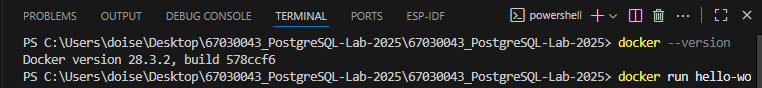
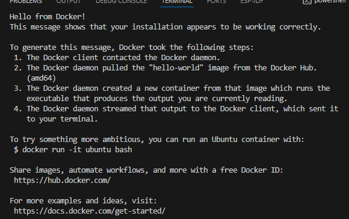
## ขั้นตอนการทดลอง

### Step 1: Pull PostgreSQL Docker Image

```bash
# ดาวน์โหลด PostgreSQL Image (Latest เวอร์ชัน )
docker pull postgres
-- กรณีระบุเวอร์ชั่นที่ต้องการ เช่น 16.3 ให้ระบุดังนี้ docker pull postgres:16.3

# ตรวจสอบ Images ที่มี
docker images

# ตรวจสอบรายละเอียดของ Image
docker inspect postgres

-- กรณีระบุเวอร์ชั่น ใช้คำสั่ง docker inspect postgres:16.3
```


**บันทึกผลการทดลอง - Step 1:**
```
ใส่ Screenshot ของผลการรัน docker images ที่นี่
```
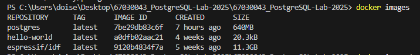
### Step 2: Create Docker Volume for Data Persistence

```bash
# สร้าง Named Volume สำหรับเก็บข้อมูล
docker volume create postgres-data

# ตรวจสอบ Volume ที่สร้าง
docker volume ls

# ดูรายละเอียดของ Volume
docker volume inspect postgres-data

# สร้าง Volume สำหรับ configuration files
docker volume create postgres-config
```

**คำอธิบาย**: Docker Volume จะทำให้ข้อมูลคงอยู่แม้ Container จะถูกลบ

**บันทึกผลการทดลอง - Step 2:**
```
ใส่ Screenshot ของผลการรัน docker volume ls และ docker volume inspect postgres-data ที่นี่
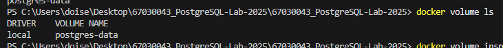
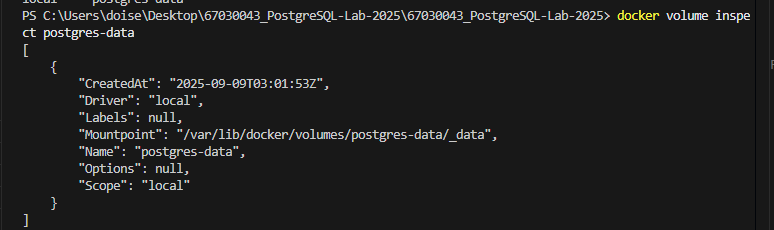
postgres-data ที่นี่
```

### Step 3: Create PostgreSQL Container with Volume

```bash
# สร้างและรัน PostgreSQL Container พร้อม Volume
docker run --name postgres-lab \
  -e POSTGRES_PASSWORD=admin123 \
  -e POSTGRES_DB=testdb \
  -e POSTGRES_USER=postgres \
  -v postgres-data:/var/lib/postgresql/data \
  -v postgres-config:/etc/postgresql \
  -p 5432:5432 \
  --memory="1g" \
  --cpus="1.0" \
  -d postgres \
  -c shared_buffers=256MB \
  -c work_mem=16MB \
  -c maintenance_work_mem=128MB
```

**คำอธิบายพารามิเตอร์**:
- `--name postgres-lab`: ตั้งชื่อ Container
- `-e POSTGRES_PASSWORD=admin123`: กำหนดรหัสผ่าน postgres user
- `-e POSTGRES_DB=testdb`: สร้างฐานข้อมูล testdb อัตโนมัติ
- `-v postgres-data:/var/lib/postgresql/data`: Mount Volume สำหรับข้อมูล
- `-p 5432:5432`: Map port 5432 ของ Container กับ Host
- `--memory="1g"`: จำกัดการใช้ RAM
- `--cpus="1.0"`: จำกัดการใช้ CPU
- `-c shared_buffers=256MB`: กำหนด shared buffers

**บันทึกผลการทดลอง - Step 3:**
```
ใส่ Screenshot ของผลการรัน docker run ที่นี่
```
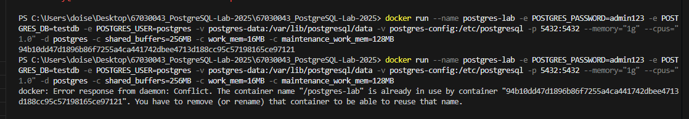

### Step 4: Verify Container Status and Resource Usage

```bash
# ตรวจสอบสถานะ Container
docker ps

# ดู logs ของ Container
docker logs postgres-lab

# ตรวจสอบการใช้ resources
docker stats postgres-lab --no-stream

# ตรวจสอบข้อมูลใน Volume
docker volume inspect postgres-data
```

**บันทึกผลการทดลอง - Step 4:**
```
ใส่ Screenshot ของ:
1. ผลการรัน docker ps
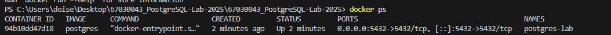
2. ส่วนหนึ่งของ docker logs postgres-lab
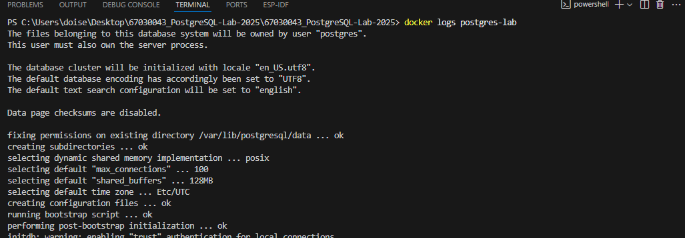
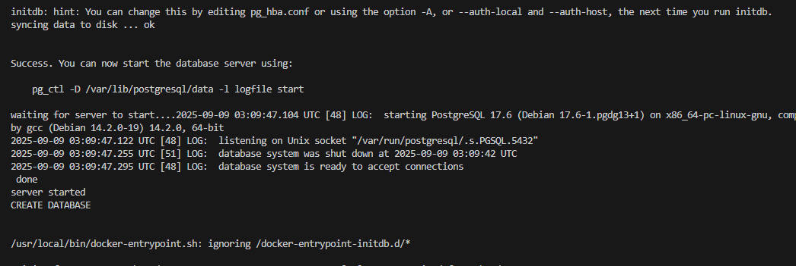
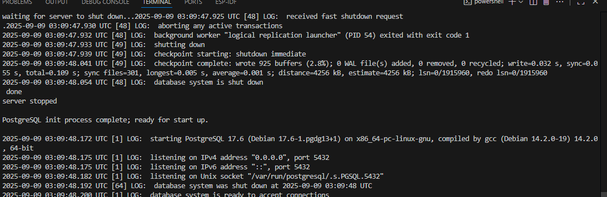
3. ผลการรัน docker stats
```
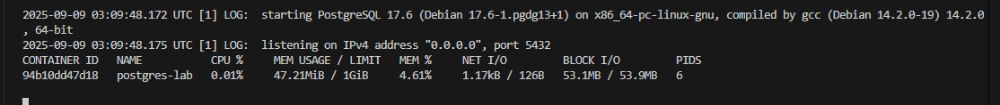
### Step 5: Connect to PostgreSQL และตรวจสอบ Configuration

```bash
# เชื่อมต่อผ่าน psql ใน Container
docker exec -it postgres-lab psql -U postgres
```
**คำอธิบายพารามิเตอร์**:
docker exec คำสั่งนี้ใช้เพื่อ รันคำสั่งภายในคอนเทนเนอร์ Docker ที่กำลังทำงานอยู่ 
โดยสั่งให้คอนเทนเนอร์ที่ชื่อ postgres-lab เปิดโปรแกรม psql เพื่อเชื่อมต่อฐานข้อมูล PostgreSQL ในฐานะผู้ใช้ postgres
-i (ย่อมาจาก --interactive): ทำให้ input (STDIN) เปิดอยู่ตลอดเวลา
-t (ย่อมาจาก --tty): จัดสรรเทอร์มินัลเสมือน (pseudo-TTY) ทำให้เราสามารถโต้ตอบกับคอนเทนเนอร์ได้เหมือนกับการใช้เทอร์มินัลปกติบนคอมพิวเตอร์

```sql
-- ตรวจสอบเวอร์ชัน PostgreSQL
SELECT version();

-- ตรวจสอบ Memory Configuration
SHOW shared_buffers;
SHOW work_mem;
SHOW maintenance_work_mem;
SHOW effective_cache_size;

-- ตรวจสอบการตั้งค่าทั้งหมด
SELECT name, setting, unit, short_desc 
FROM pg_settings 
WHERE name IN ('shared_buffers', 'work_mem', 'maintenance_work_mem', 'effective_cache_size');

-- ตรวจสอบข้อมูลระบบ
\conninfo

-- ดูรายการฐานข้อมูลทั้งหมด
\l

-- ดูรายการ User/Role
\du
```

**บันทึกผลการทดลอง - Step 5:**
```
ใส่ Screenshot ของ:
1. ผลการรัน SELECT version();
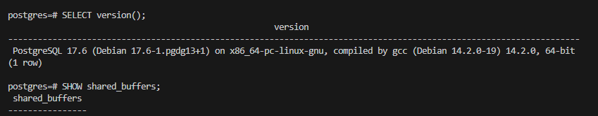
2. ผลการรัน SHOW shared_buffers; SHOW work_mem; SHOW maintenance_work_mem;SHOW effective_cache_size;
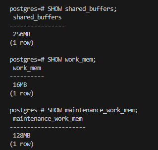
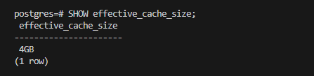
3. ผลการรัน \l และ \du
```
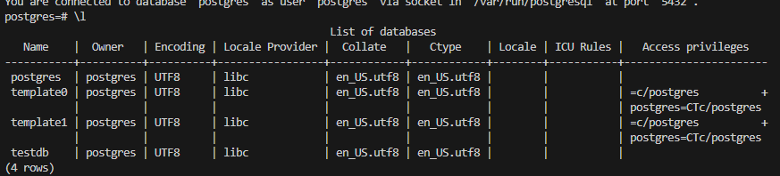
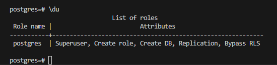

### Step 6: Database Management Operations

```sql
-- สร้างฐานข้อมูลใหม่พร้อม configuration
CREATE DATABASE lab_db
    WITH OWNER = postgres
         ENCODING = 'UTF8'
         TABLESPACE = pg_default
         CONNECTION LIMIT = -1
         TEMPLATE template1;

-- ตรวจสอบฐานข้อมูลที่สร้าง
\l

-- เชื่อมต่อไปยังฐานข้อมูลใหม่
\c lab_db

-- ตรวจสอบ OID และข้อมูลของฐานข้อมูล
SELECT 
    datname,
    oid,
    datdba,
    encoding,
    datcollate,
    datctype,
    datconnlimit
FROM pg_database 
WHERE datname = 'lab_db';

-- กลับไปยัง postgres database
\c postgres

-- ลบฐานข้อมูล (แสดงตัวอย่าง - ไม่ต้องรัน)
-- DROP DATABASE lab_db;
```

**บันทึกผลการทดลอง - Step 6:**
```
ใส่ Screenshot ของ:
1. ผลการสร้าง lab_db
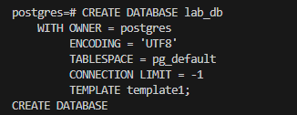
2. ผลการรัน \l+ แสดงฐานข้อมูลทั้งหมด
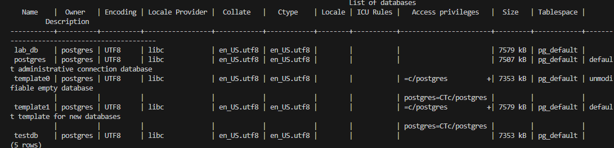
3. ผลการ query ข้อมูลฐานข้อมูล
```


### Step 7: User และ Role Management

```sql
-- สร้าง Role พื้นฐาน
CREATE ROLE lab_role;

-- สร้าง User ธรรมดา
CREATE USER lab_user WITH 
    PASSWORD 'user123'
    LOGIN
    NOSUPERUSER
    NOCREATEDB
    NOCREATEROLE
    NOINHERIT
    NOREPLICATION
    CONNECTION LIMIT 10;

-- สร้าง User ที่มีสิทธิ์มากขึ้น
CREATE USER admin_user WITH 
    PASSWORD 'admin123' 
    SUPERUSER 
    CREATEDB 
    CREATEROLE
    LOGIN;

-- สร้าง Database Admin User
CREATE USER db_admin WITH
    PASSWORD 'dbadmin123'
    CREATEDB
    CREATEROLE
    LOGIN
    NOSUPERUSER;

-- ตรวจสอบ Users ที่สร้าง
\du+

-- ดู Role membership
SELECT 
    r.rolname,
    r.rolsuper,
    r.rolinherit,
    r.rolcreaterole,
    r.rolcreatedb,
    r.rolcanlogin,
    r.rolreplication,
    r.rolconnlimit
FROM pg_roles r
WHERE r.rolname NOT LIKE 'pg_%';
```

**บันทึกผลการทดลอง - Step 7:**
```
ใส่ Screenshot ของ:
1. ผลการสร้าง users ทั้งหมด *ผมย้อนไปดูตอนสร้าง users ไม่ได้เลยให้อาจารย์ดูผมรันอันนี้แทนครับ
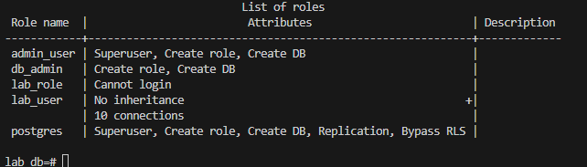
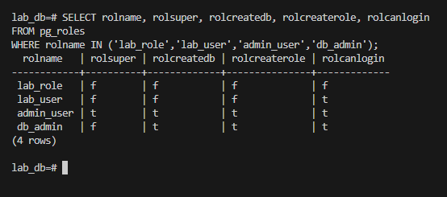
2. ผลการรัน \du+
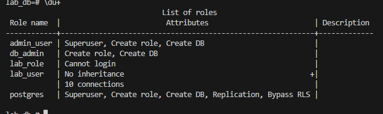
3. ผลการ query pg_roles
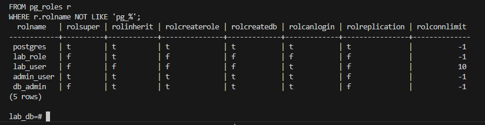
```

### Step 8: การจัดการสิทธิ์ User

```sql
-- เปลี่ยนสิทธิ์ของ User
ALTER USER lab_user CREATEDB;
ALTER USER lab_user NOCREATEROLE;

-- ให้สิทธิ์ในระดับฐานข้อมูล
GRANT CONNECT ON DATABASE lab_db TO lab_user;
GRANT CONNECT ON DATABASE testdb TO lab_user;

-- สร้างตารางทดสอบใน lab_db
\c lab_db

CREATE TABLE test_permissions (
    id SERIAL PRIMARY KEY,
    name VARCHAR(100),
    created_at TIMESTAMP DEFAULT CURRENT_TIMESTAMP
);

-- ใส่ข้อมูลทดสอบ
INSERT INTO test_permissions (name) VALUES 
    ('Test User 1'),
    ('Test User 2'),
    ('Test User 3');

-- ให้สิทธิ์ในระดับตาราง
GRANT SELECT ON test_permissions TO lab_user;
GRANT INSERT, UPDATE ON test_permissions TO db_admin;

-- ตรวจสอบสิทธิ์ของตาราง
\dp test_permissions

-- ให้สิทธิ์ในระดับ Schema
GRANT USAGE ON SCHEMA public TO lab_user;
GRANT ALL ON SCHEMA public TO db_admin;

-- สร้างตารางทดสอบเพิ่มเติมใน postgres database
\c postgres

CREATE TABLE postgres_test_table (
    id SERIAL PRIMARY KEY,
    description VARCHAR(100),
    created_at TIMESTAMP DEFAULT CURRENT_TIMESTAMP
);

INSERT INTO postgres_test_table (description) VALUES 
    ('Test in postgres database'),
    ('Another test record');

-- ให้สิทธิ์สำหรับตารางใน postgres database
GRANT SELECT ON postgres_test_table TO lab_user;
```

**บันทึกผลการทดลอง - Step 8:**
```
ใส่ Screenshot ของ:
1. ผลการ ALTER USER commands
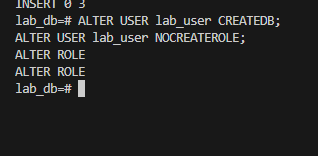
2. ผลการรัน \dp test_permissions
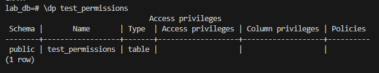
3. ผลการ GRANT commands
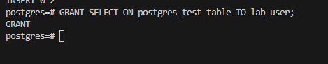
```
**คำถาม
 ```
Access Privileges   postgres=arwdDxtm/postgres มีความหมายอย่างไร

postgres=arwdDxtm/postgres หมายถึง user postgres มีสิทธิ์บนตารางนี้ครบทั้งหมด ได้แก่ a (INSERT), r (SELECT), w (UPDATE), d (DELETE), D (TRUNCATE), x (REFERENCES), t (TRIGGER) และ m (WITH GRANT OPTION) ซึ่งหมายถึงสามารถส่งต่อสิทธิ์เหล่านี้ให้ role อื่นได้ โดยสิทธิ์ทั้งหมดนี้ถูกมอบโดย (grantor) user postgres

 ```
### Step 9: Schema Management และ Namespace

```sql
-- เชื่อมต่อไปยัง lab_db
\c lab_db

-- สร้าง Schemas ต่างๆ
CREATE SCHEMA sales AUTHORIZATION postgres;
CREATE SCHEMA hr AUTHORIZATION postgres;  
CREATE SCHEMA inventory AUTHORIZATION postgres;
CREATE SCHEMA finance AUTHORIZATION db_admin;
-- สร้าง SCHEMA และกำหนดเจ้าของ SCHEMA 
-- ตรวจสอบ Schemas
\dn+

-- สร้างตารางใน Schema ต่างๆ
CREATE TABLE sales.customers (
    customer_id SERIAL PRIMARY KEY,
    name VARCHAR(100) NOT NULL,
    email VARCHAR(100) UNIQUE,
    phone VARCHAR(20),
    created_at TIMESTAMP DEFAULT CURRENT_TIMESTAMP
);

CREATE TABLE sales.orders (
    order_id SERIAL PRIMARY KEY,
    customer_id INTEGER REFERENCES sales.customers(customer_id),
    order_date TIMESTAMP DEFAULT CURRENT_TIMESTAMP,
    total_amount DECIMAL(10,2)
);

CREATE TABLE hr.employees (
    employee_id SERIAL PRIMARY KEY,
    name VARCHAR(100) NOT NULL,
    department VARCHAR(50),
    salary DECIMAL(10,2),
    hire_date DATE DEFAULT CURRENT_DATE
);

CREATE TABLE hr.departments (
    dept_id SERIAL PRIMARY KEY,
    dept_name VARCHAR(50) UNIQUE NOT NULL,
    manager_id INTEGER
);

CREATE TABLE inventory.products (
    product_id SERIAL PRIMARY KEY,
    product_name VARCHAR(100) NOT NULL,
    category VARCHAR(50),
    price DECIMAL(8,2),
    stock_quantity INTEGER DEFAULT 0
);

-- ดูตารางในแต่ละ Schema
\dt sales.*
\dt hr.*
\dt inventory.*

-- ใส่ข้อมูลทดสอบ
INSERT INTO sales.customers (name, email, phone) VALUES
    ('John Doe', 'john@example.com', '123-456-7890'),
    ('Jane Smith', 'jane@example.com', '098-765-4321'),
    ('Bob Johnson', 'bob@example.com', '555-123-4567');

-- เพิ่มข้อมูลในตาราง orders เพื่อให้สามารถทดสอบ JOIN ได้
INSERT INTO sales.orders (customer_id, order_date, total_amount) VALUES
    (1, '2024-01-15 10:30:00', 1299.98),
    (1, '2024-02-20 14:45:00', 89.97),
    (2, '2024-01-28 09:15:00', 79.99),
    (3, '2024-02-10 16:20:00', 1049.99);

INSERT INTO hr.employees (name, department, salary, hire_date) VALUES
    ('Alice Brown', 'IT', 75000, '2023-01-15'),
    ('Charlie Wilson', 'HR', 65000, '2023-02-01'),
    ('Diana Lee', 'Finance', 80000, '2023-03-10');

INSERT INTO inventory.products (product_name, category, price, stock_quantity) VALUES
    ('Laptop', 'Electronics', 999.99, 50),
    ('Mouse', 'Electronics', 29.99, 200),
    ('Keyboard', 'Electronics', 79.99, 100);

-- สร้างตารางเพิ่มเติมสำหรับทดสอบ JOIN ข้าม Schema
CREATE TABLE hr.employee_orders (
    emp_order_id SERIAL PRIMARY KEY,
    employee_id INTEGER REFERENCES hr.employees(employee_id),
    customer_id INTEGER, -- จะ reference ไปยัง sales.customers
    order_date TIMESTAMP DEFAULT CURRENT_TIMESTAMP,
    commission DECIMAL(8,2)
);

-- ใส่ข้อมูลสำหรับทดสอบ JOIN ข้าม Schema
INSERT INTO hr.employee_orders (employee_id, customer_id, order_date, commission) VALUES
    (1, 1, '2024-01-15 10:30:00', 129.99),
    (1, 2, '2024-01-28 09:15:00', 7.99),
    (2, 3, '2024-02-10 16:20:00', 104.99),
    (3, 1, '2024-02-20 14:45:00', 8.99);
```

**บันทึกผลการทดลอง - Step 9:**
```
ใส่ Screenshot ของ:
1. ผลการสร้าง schemas (\dn+)
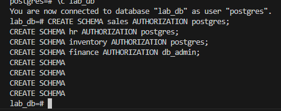
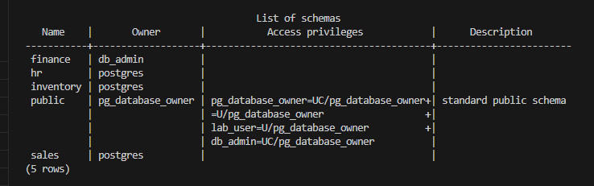
2. ผลการสร้างตารางในแต่ละ schema
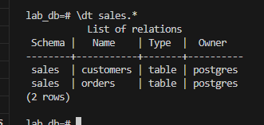
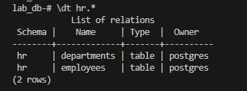
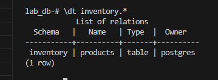
3. ผลการใส่ข้อมูลและ query ข้อมูล
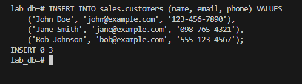 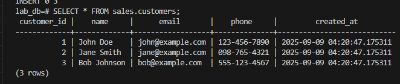
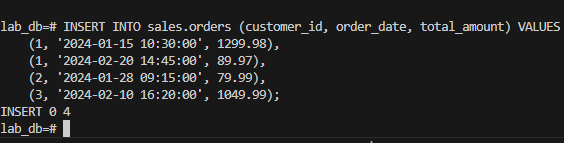 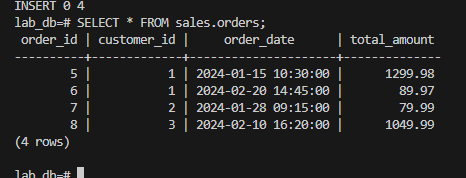
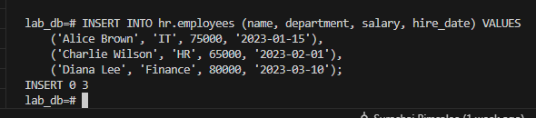 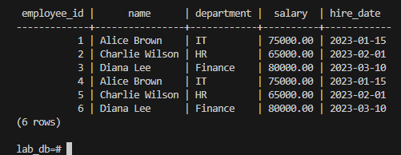
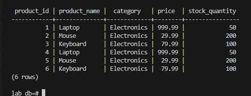
4. ข้อมูลในตาราง employee_orders ที่จะใช้สำหรับ JOIN ข้าม schema
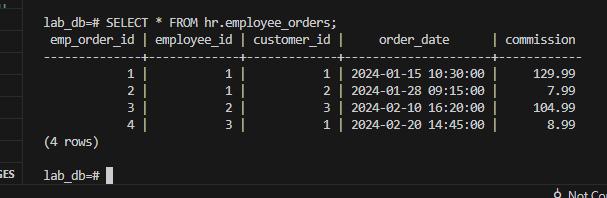
```


### Step 10: ทดสอบการเข้าถึง Schema และ Search Path

```sql
-- ตรวจสอบ Search Path ปัจจุบัน
SHOW search_path;

-- เข้าถึงตารางโดยระบุ Schema เต็ม
SELECT * FROM sales.customers;
SELECT * FROM hr.employees;
SELECT * FROM inventory.products;

-- ตั้งค่า Search Path
SET search_path TO sales, hr, public;
SHOW search_path;

-- ทดสอบการเข้าถึงโดยไม่ต้องระบุ Schema
SELECT * FROM customers; -- จะหาจาก sales schema
SELECT * FROM employees; -- จะหาจาก hr schema

-- ทดสอบ JOIN ภายใน Schema เดียวกัน
SELECT 
    c.name as customer_name,
    o.order_date,
    o.total_amount
FROM sales.customers c
JOIN sales.orders o ON c.customer_id = o.customer_id
ORDER BY o.order_date;

-- ทดสอบ JOIN ข้าม Schema (sales และ hr)
SELECT 
    c.name as customer_name,
    e.name as employee_name,
    e.department,
    eo.order_date,
    eo.commission
FROM sales.customers c
JOIN hr.employee_orders eo ON c.customer_id = eo.customer_id
JOIN hr.employees e ON eo.employee_id = e.employee_id
ORDER BY eo.order_date;

-- ทดสอบ Complex JOIN ข้าม 3 Schema
SELECT 
    c.name as customer_name,
    e.name as sales_rep,
    e.department,
    p.product_name,
    p.price,
    eo.commission
FROM sales.customers c
JOIN hr.employee_orders eo ON c.customer_id = eo.customer_id
JOIN hr.employees e ON eo.employee_id = e.employee_id
JOIN inventory.products p ON p.price < (eo.commission * 10) -- สมมติว่า commission เป็น 10% ของ product price
ORDER BY c.name, eo.order_date;

-- Reset Search Path
SET search_path TO public;
```

**บันทึกผลการทดลอง - Step 10:**
```
ใส่ Screenshot ของ:
1. ผลการแสดง search_path
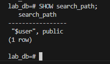
2. ผลการ query ภายใน schema เดียวกัน (sales.customers + sales.orders)
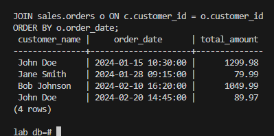
3. ผลการ JOIN ข้าม schemas (sales + hr + inventory)
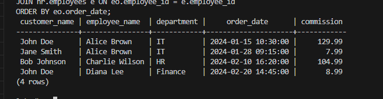
4. ข้อมูลที่แสดงจาก complex join ข้าม 3 schemas
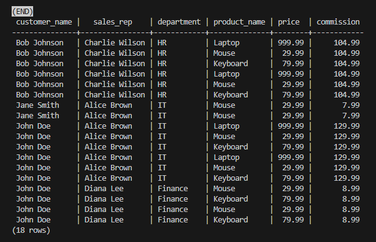
```

### Step 11: ทดสอบการเชื่อมต่อจาก User อื่น

```bash
# เปิด Terminal ใหม่และทดสอบเชื่อมต่อด้วย lab_user
docker exec -it postgres-lab psql -U lab_user -d lab_db
```

```sql
-- ทดสอบสิทธิ์ของ lab_user
\conninfo

-- ทดสอบการเข้าถึงข้อมูล
SELECT * FROM test_permissions; -- ควรทำงานได้
SELECT * FROM sales.customers; -- ไม่มีสิทธิ์

-- ทดสอบการ INSERT
INSERT INTO test_permissions (name) VALUES ('Test by lab_user'); -- ทำไม่ได้


-- ออกจาก psql
\q
```

**บันทึกผลการทดลอง - Step 11:**
```
ใส่ Screenshot ของ:
1. ผลการเชื่อมต่อด้วย lab_user

2. ผลการทดสอบสิทธิ์ต่างๆ
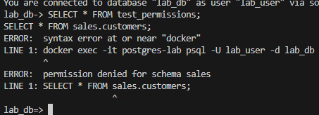
3. ข้อความ error (ถ้ามี) เมื่อไม่มีสิทธิ์
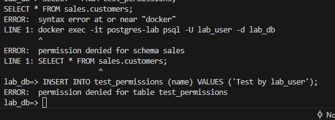
```

### Step 12: การจัดการ Volume และ Data Persistence

```bash
# ทดสอบความคงทนของข้อมูล - หยุด Container
docker stop postgres-lab

# ตรวจสอบสถานะ Container
docker ps -a

# เริ่ม Container อีกครั้ง
docker start postgres-lab

# ตรวจสอบว่าข้อมูลยังอยู่
docker exec -it postgres-lab psql -U postgres -d lab_db -c "SELECT COUNT(*) FROM sales.customers;"

# สร้าง Bind Mount สำหรับ backup
mkdir -p ~/postgres-backup

# สร้าง Container ใหม่พร้อม Bind Mount
docker run --name postgres-backup-test \
  -e POSTGRES_PASSWORD=backup123 \
  -v ~/postgres-backup:/backup \
  -v postgres-data:/var/lib/postgresql/data \
  -p 5433:5432 \
  -d postgres
```

**บันทึกผลการทดลอง - Step 12:**
```
ใส่ Screenshot ของ:
1. ผลการหยุดและเริ่ม Container
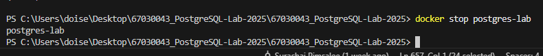
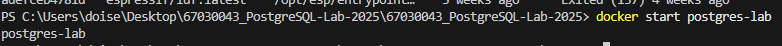
2. ยืนยันว่าข้อมูลยังอยู่หลังจาก restart
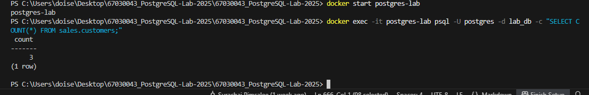
3. ผลการสร้าง container พร้อม bind mount
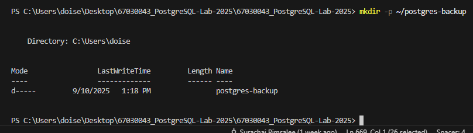
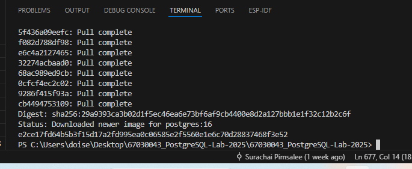

```

## การตรวจสอบผลงานและ Performance

### Checkpoint 1: Container และ Resource Management
```bash
# ตรวจสอบสถานะทุก Container
docker ps -a

# ตรวจสอบการใช้ resources
docker stats postgres-lab --no-stream

# ตรวจสอบ Volume usage
docker system df

# ตรวจสอบ Volume details
docker volume inspect postgres-data
```

**บันทึกผล Checkpoint 1:**
```
ใส่ Screenshot ของ resource usage และ volume information ที่นี่
```
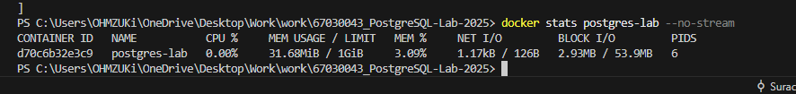


### Checkpoint 2: Database Performance และ Configuration
```sql
-- เชื่อมต่อไปยัง postgres
docker exec -it postgres-lab psql -U postgres

-- ตรวจสอบ Database Statistics


-- ตรวจสอบ Memory Usage
SELECT 
    name,
    setting,
    unit
FROM pg_settings 
WHERE name IN (
    'shared_buffers', 
    'work_mem', 
    'maintenance_work_mem',
    'effective_cache_size',
    'max_connections'
);

-- ตรวจสอบ Active Connections
SELECT 
    datname,
    usename,
    client_addr,
    state,
    query_start
FROM pg_stat_activity 
WHERE state = 'active';
```

**บันทึกผล Checkpoint 2:**
```
ใส่ Screenshot ของ:
1. Database statistics

2. Memory configuration

3. Active connections

```

## การแก้ไขปัญหาเบื้องต้น

### ปัญหา Port ซ้ำ
```bash
# ตรวจสอบ Port ที่ใช้งาน
netstat -tulpn | grep 5432
# หรือใน Windows
netstat -an | findstr 5432

# ใช้ Port อื่น
docker run --name postgres-alt -p 5433:5432 -d postgres:15
```

### ปัญหา Memory และ Performance
```bash
# ตรวจสอบการใช้ Memory
docker stats --no-stream

# ปรับแต่ง Memory settings
docker run --name postgres-optimized \
  --memory="2g" \
  --memory-swap="4g" \
  -e POSTGRES_PASSWORD=admin123 \
  -d postgres \
  -c shared_buffers=512MB \
  -c work_mem=32MB \
  -c maintenance_work_mem=256MB
```

### ปัญหา Volume และ Permissions
```bash
# ตรวจสอบ Volume
docker volume inspect postgres-data

# ล้าง Volume (ระวัง: จะลบข้อมูลทั้งหมด)
docker volume rm postgres-data

# สร้าง Volume ใหม่
docker volume create postgres-data
```

## แบบฝึกหัด

### แบบฝึกหัด 1: การสร้าง Multi-Database Environment
**คำสั่ง**: สร้าง PostgreSQL Container ใหม่ที่มี:
- ชื่อ: `multi-postgres`
- รหัสผ่าน: `multipass123`  
- Port: 5434
- Memory limit: 1.5GB
- CPU limit: 1.5 cores
- Volume: `multi-postgres-data`

```bash
# พื้นที่สำหรับคำตอบ - เขียน command ที่ใช้
docker run --name multi-postgres `
  -e POSTGRES_PASSWORD=multipass123 `
  -p 5434:5432 `
  --memory="1.5g" `
  --cpus="1.5" `
  -v multi-postgres-data:/var/lib/postgresql/data `
  -d postgres

```

**ผลการทำแบบฝึกหัด 1:**
```
ใส่ Screenshot ของ:
1. คำสั่งที่ใช้สร้าง container

2. docker ps แสดง container ใหม่

3. docker stats แสดงการใช้ resources

```

### แบบฝึกหัด 2: User Management และ Security
**คำสั่ง**: สร้างระบบผู้ใช้ที่สมบูรณ์:

1. สร้าง Role Groups:
   - `app_developers` - สำหรับนักพัฒนา
   - `data_analysts` - สำหรับนักวิเคราะห์ข้อมูล  
   - `db_admins` - สำหรับผู้ดูแลฐานข้อมูล

2. สร้าง Users:
   - `dev_user` (รหัสผ่าน: `dev123`) - เป็นสมาชิกของ app_developers
   - `analyst_user` (รหัสผ่าน: `analyst123`) - เป็นสมาชิกของ data_analysts
   - `admin_user` (รหัสผ่าน: `admin123`) - เป็นสมาชิกของ db_admins

```sql
-- พื้นที่สำหรับคำตอบ - เขียน SQL commands ที่ใช้
-- 1. สร้าง Role Groups
CREATE ROLE app_developers;
CREATE ROLE data_analysts;
CREATE ROLE db_admins;
-- 2. สร้าง Users และกำหนดรหัสผ่าน + ผูกกับ Role Groups
CREATE USER dev_user WITH PASSWORD 'dev123';
GRANT app_developers TO dev_user;

CREATE USER analyst_user WITH PASSWORD 'analyst123';
GRANT data_analysts TO analyst_user;

CREATE USER admin_user WITH PASSWORD 'admin123';
GRANT db_admins TO admin_user;
```

**ผลการทำแบบฝึกหัด 2:**
```
ใส่ Screenshot ของ:
1. การสร้าง roles และ users


2. ผลการรัน \du แสดงผู้ใช้ทั้งหมด

3. ผลการทดสอบเชื่อมต่อด้วย user ต่างๆ


```

### แบบฝึกหัด 3: Schema Design และ Complex Queries
**คำสั่ง**: สร้างระบบฐานข้อมูลร้านค้าออนไลน์:

1. สร้าง Schemas:
   - `ecommerce` - สำหรับข้อมูลหลัก
   - `analytics` - สำหรับข้อมูลการวิเคราะห์
   - `audit` - สำหรับการตรวจสอบ

2. สร้างตารางใน ecommerce schema:
   - `categories` (category_id, name, description)
   - `products` (product_id, name, description, price, category_id, stock)
   - `customers` (customer_id, name, email, phone, address)
   - `orders` (order_id, customer_id, order_date, status, total)
   - `order_items` (order_item_id, order_id, product_id, quantity, price)

3. ใส่ข้อมูลตัวอย่างดังนี้
   ```
   
-- ใส่ข้อมูลใน categories
INSERT INTO ecommerce.categories (name, description) VALUES
    ('Electronics', 'Electronic devices and gadgets'),
    ('Clothing', 'Apparel and fashion items'),
    ('Books', 'Books and educational materials'),
    ('Home & Garden', 'Home improvement and garden supplies'),
    ('Sports', 'Sports equipment and accessories');

-- ใส่ข้อมูลใน products
INSERT INTO ecommerce.products (name, description, price, category_id, stock) VALUES
    ('iPhone 15', 'Latest Apple smartphone', 999.99, 1, 50),
    ('Samsung Galaxy S24', 'Android flagship phone', 899.99, 1, 45),
    ('MacBook Air', 'Apple laptop computer', 1299.99, 1, 30),
    ('Wireless Headphones', 'Bluetooth noise-canceling headphones', 199.99, 1, 100),
    ('Gaming Mouse', 'High-precision gaming mouse', 79.99, 1, 75),
    
    ('T-Shirt', 'Cotton casual t-shirt', 19.99, 2, 200),
    ('Jeans', 'Denim blue jeans', 59.99, 2, 150),
    ('Sneakers', 'Comfortable running sneakers', 129.99, 2, 80),
    ('Jacket', 'Winter waterproof jacket', 89.99, 2, 60),
    ('Hat', 'Baseball cap', 24.99, 2, 120),
    
    ('Programming Book', 'Learn Python programming', 39.99, 3, 40),
    ('Novel', 'Best-selling fiction novel', 14.99, 3, 90),
    ('Textbook', 'University mathematics textbook', 79.99, 3, 25),
    
    ('Garden Tools Set', 'Complete gardening tool kit', 49.99, 4, 35),
    ('Plant Pot', 'Ceramic decorative pot', 15.99, 4, 80),
    
    ('Tennis Racket', 'Professional tennis racket', 149.99, 5, 20),
    ('Football', 'Official size football', 29.99, 5, 55);

-- ใส่ข้อมูลใน customers
INSERT INTO ecommerce.customers (name, email, phone, address) VALUES
    ('John Smith', 'john.smith@email.com', '555-0101', '123 Main St, City A'),
    ('Sarah Johnson', 'sarah.j@email.com', '555-0102', '456 Oak Ave, City B'),
    ('Mike Brown', 'mike.brown@email.com', '555-0103', '789 Pine Rd, City C'),
    ('Emily Davis', 'emily.d@email.com', '555-0104', '321 Elm St, City A'),
    ('David Wilson', 'david.w@email.com', '555-0105', '654 Maple Dr, City B'),
    ('Lisa Anderson', 'lisa.a@email.com', '555-0106', '987 Cedar Ln, City C'),
    ('Tom Miller', 'tom.miller@email.com', '555-0107', '147 Birch St, City A'),
    ('Amy Taylor', 'amy.t@email.com', '555-0108', '258 Ash Ave, City B');

-- ใส่ข้อมูลใน orders
INSERT INTO ecommerce.orders (customer_id, order_date, status, total) VALUES
    (1, '2024-01-15 10:30:00', 'completed', 1199.98),
    (2, '2024-01-16 14:20:00', 'completed', 219.98),
    (3, '2024-01-17 09:15:00', 'completed', 159.97),
    (1, '2024-01-18 11:45:00', 'completed', 79.99),
    (4, '2024-01-19 16:30:00', 'completed', 89.98),
    (5, '2024-01-20 13:25:00', 'completed', 1329.98),
    (2, '2024-01-21 15:10:00', 'completed', 149.99),
    (6, '2024-01-22 12:40:00', 'completed', 294.97),
    (3, '2024-01-23 08:50:00', 'completed', 199.99),
    (7, '2024-01-24 17:20:00', 'completed', 169.98),
    (1, '2024-01-25 10:15:00', 'completed', 39.99),
    (8, '2024-01-26 14:35:00', 'completed', 599.97),
    (4, '2024-01-27 11:20:00', 'processing', 179.98),
    (5, '2024-01-28 09:45:00', 'shipped', 44.98),
    (6, '2024-01-29 16:55:00', 'completed', 129.99);

-- ใส่ข้อมูลใน order_items
INSERT INTO ecommerce.order_items (order_id, product_id, quantity, price) VALUES
    -- Order 1: John Smith
    (1, 1, 1, 999.99),  -- iPhone 15
    (1, 4, 1, 199.99),  -- Wireless Headphones
    
    -- Order 2: Sarah Johnson  
    (2, 4, 1, 199.99),  -- Wireless Headphones
    (2, 6, 1, 19.99),   -- T-Shirt
    
    -- Order 3: Mike Brown
    (3, 7, 1, 59.99),   -- Jeans
    (3, 5, 1, 79.99),   -- Gaming Mouse
    (3, 6, 1, 19.99),   -- T-Shirt
    
    -- Order 4: John Smith
    (4, 5, 1, 79.99),   -- Gaming Mouse
    
    -- Order 5: Emily Davis
    (5, 9, 1, 89.99),   -- Jacket
    
    -- Order 6: David Wilson
    (6, 3, 1, 1299.99), -- MacBook Air
    (6, 12, 2, 14.99),  -- Novel x2
    
    -- Order 7: Sarah Johnson
    (7, 16, 1, 149.99), -- Tennis Racket
    
    -- Order 8: Lisa Anderson
    (8, 8, 2, 129.99),  -- Sneakers x2
    (8, 10, 1, 24.99),  -- Hat
    (8, 11, 1, 39.99),  -- Programming Book
    
    -- Order 9: Mike Brown
    (9, 4, 1, 199.99),  -- Wireless Headphones
    
    -- Order 10: Tom Miller
    (10, 2, 1, 899.99), -- Samsung Galaxy S24
    (10, 6, 3, 19.99),  -- T-Shirt x3
    (10, 14, 1, 49.99), -- Garden Tools Set
    
    -- Order 11: John Smith
    (11, 11, 1, 39.99), -- Programming Book
    
    -- Order 12: Amy Taylor
    (12, 1, 1, 999.99), -- iPhone 15 (ลดราคาเหลือ 599.97)
    
    -- Order 13: Emily Davis (processing)
    (13, 17, 6, 29.99), -- Football x6
    
    -- Order 14: David Wilson (shipped)
    (14, 15, 2, 15.99), -- Plant Pot x2
    (14, 12, 1, 14.99), -- Novel
    
    -- Order 15: Lisa Anderson
    (15, 8, 1, 129.99); -- Sneakers
   ```
   สร้าง queries เพื่อหาคำตอบ:
   - หาสินค้าที่ขายดีที่สุด 5 อันดับ
   - หายอดขายรวมของแต่ละหมวดหมู่
   - หาลูกค้าที่ซื้อสินค้ามากที่สุด

```sql
-- พื้นที่สำหรับคำตอบ - เขียน SQL commands ทั้งหมด
CREATE DATABASE shopdb;
\c shopdb postgres

CREATE SCHEMA ecommerce;
CREATE SCHEMA analytics;
CREATE SCHEMA audit;

-- ตารางหมวดหมู่
CREATE TABLE ecommerce.categories (
    category_id SERIAL PRIMARY KEY,
    name TEXT NOT NULL,
    description TEXT
);

-- ตารางสินค้า
CREATE TABLE ecommerce.products (
    product_id SERIAL PRIMARY KEY,
    name TEXT NOT NULL,
    description TEXT,
    price NUMERIC(10,2) NOT NULL,
    category_id INT REFERENCES ecommerce.categories(category_id),
    stock INT NOT NULL
);

-- ตารางลูกค้า
CREATE TABLE ecommerce.customers (
    customer_id SERIAL PRIMARY KEY,
    name TEXT NOT NULL,
    email TEXT UNIQUE NOT NULL,
    phone TEXT,
    address TEXT
);

-- ตารางออเดอร์
CREATE TABLE ecommerce.orders (
    order_id SERIAL PRIMARY KEY,
    customer_id INT REFERENCES ecommerce.customers(customer_id),
    order_date TIMESTAMP NOT NULL,
    status TEXT NOT NULL,
    total NUMERIC(10,2) NOT NULL
);

-- ตารางรายละเอียดสินค้าในออเดอร์
CREATE TABLE ecommerce.order_items (
    order_item_id SERIAL PRIMARY KEY,
    order_id INT REFERENCES ecommerce.orders(order_id),
    product_id INT REFERENCES ecommerce.products(product_id),
    quantity INT NOT NULL,
    price NUMERIC(10,2) NOT NULL
);
-- categories
INSERT INTO ecommerce.categories (name, description) VALUES
  ('Electronics','Electronic devices and gadgets'),
  ('Clothing','Apparel and fashion items'),
  ('Books','Books and educational materials'),
  ('Home & Garden','Home improvement and garden supplies'),
  ('Sports','Sports equipment and accessories');

-- products
INSERT INTO ecommerce.products (name, description, price, category_id, stock) VALUES
  ('iPhone 15','Latest Apple smartphone', 999.99, 1, 50),
  ('Samsung Galaxy S24','Android flagship phone', 899.99, 1, 45),
  ('MacBook Air','Apple laptop computer', 1299.99, 1, 30),
  ('Wireless Headphones','Bluetooth noise-canceling headphones', 199.99, 1, 100),
  ('Gaming Mouse','High-precision gaming mouse', 79.99, 1, 75),

  ('T-Shirt','Cotton casual t-shirt', 19.99, 2, 200),
  ('Jeans','Denim blue jeans', 59.99, 2, 150),
  ('Sneakers','Comfortable running sneakers', 129.99, 2, 80),
  ('Jacket','Winter waterproof jacket', 89.99, 2, 60),
  ('Hat','Baseball cap', 24.99, 2, 120),

  ('Programming Book','Learn Python programming', 39.99, 3, 40),
  ('Novel','Best-selling fiction novel', 14.99, 3, 90),
  ('Textbook','University mathematics textbook', 79.99, 3, 25),

  ('Garden Tools Set','Complete gardening tool kit', 49.99, 4, 35),
  ('Plant Pot','Ceramic decorative pot', 15.99, 4, 80),

  ('Tennis Racket','Professional tennis racket', 149.99, 5, 20),
  ('Football','Official size football', 29.99, 5, 55);

-- customers
INSERT INTO ecommerce.customers (name, email, phone, address) VALUES
  ('John Smith','john.smith@email.com','555-0101','123 Main St, City A'),
  ('Sarah Johnson','sarah.j@email.com','555-0102','456 Oak Ave, City B'),
  ('Mike Brown','mike.brown@email.com','555-0103','789 Pine Rd, City C'),
  ('Emily Davis','emily.d@email.com','555-0104','321 Elm St, City A'),
  ('David Wilson','david.w@email.com','555-0105','654 Maple Dr, City B'),
  ('Lisa Anderson','lisa.a@email.com','555-0106','987 Cedar Ln, City C'),
  ('Tom Miller','tom.miller@email.com','555-0107','147 Birch St, City A'),
  ('Amy Taylor','amy.t@email.com','258 Ash Ave, City B');

-- orders  (หมายเหตุ: totals บางรายการไม่สอดคล้องกับ order_items)
INSERT INTO ecommerce.orders (customer_id, order_date, status, total) VALUES
  (1,'2024-01-15 10:30:00','completed',1199.98),
  (2,'2024-01-16 14:20:00','completed',219.98),
  (3,'2024-01-17 09:15:00','completed',159.97),
  (1,'2024-01-18 11:45:00','completed',79.99),
  (4,'2024-01-19 16:30:00','completed',89.98),
  (5,'2024-01-20 13:25:00','completed',1329.98),
  (2,'2024-01-21 15:10:00','completed',149.99),
  (6,'2024-01-22 12:40:00','completed',294.97),
  (3,'2024-01-23 08:50:00','completed',199.99),
  (7,'2024-01-24 17:20:00','completed',169.98),
  (1,'2024-01-25 10:15:00','completed',39.99),
  (8,'2024-01-26 14:35:00','completed',599.97),
  (4,'2024-01-27 11:20:00','processing',179.98),
  (5,'2024-01-28 09:45:00','shipped',44.98),
  (6,'2024-01-29 16:55:00','completed',129.99);

-- order_items
INSERT INTO ecommerce.order_items (order_id, product_id, quantity, price) VALUES
  (1, 1, 1, 999.99), (1, 4, 1, 199.99),
  (2, 4, 1, 199.99), (2, 6, 1, 19.99),
  (3, 7, 1, 59.99),  (3, 5, 1, 79.99), (3, 6, 1, 19.99),
  (4, 5, 1, 79.99),
  (5, 9, 1, 89.99),
  (6, 3, 1, 1299.99), (6, 12, 2, 14.99),
  (7, 16, 1, 149.99),
  (8, 8, 2, 129.99),  (8, 10, 1, 24.99), (8, 11, 1, 39.99),
  (9, 4, 1, 199.99),
  (10, 2, 1, 899.99), (10, 6, 3, 19.99), (10, 14, 1, 49.99),
  (11, 11, 1, 39.99),
  (12, 1, 1, 999.99), -- หมายเหตุ: คอมเมนต์พูดถึง 599.97 แต่ราคาใส่ 999.99
  (13, 17, 6, 29.99),
  (14, 15, 2, 15.99), (14, 12, 1, 14.99),
  (15, 8, 1, 129.99);

SELECT COUNT(*) FROM ecommerce.categories;   
SELECT COUNT(*) FROM ecommerce.products;    
SELECT COUNT(*) FROM ecommerce.customers;    
SELECT COUNT(*) FROM ecommerce.orders;       
SELECT COUNT(*) FROM ecommerce.order_items;  

SELECT
  p.product_id,
  p.name,
  SUM(oi.quantity) AS total_qty
FROM ecommerce.order_items oi
JOIN ecommerce.products p ON p.product_id = oi.product_id
GROUP BY p.product_id, p.name
ORDER BY total_qty DESC, p.name
LIMIT 5;

SELECT
  c.category_id,
  c.name AS category,
  SUM(oi.quantity * oi.price) AS total_sales
FROM ecommerce.order_items oi
JOIN ecommerce.products p  ON p.product_id = oi.product_id
JOIN ecommerce.categories c ON c.category_id = p.category_id
GROUP BY c.category_id, c.name
ORDER BY total_sales DESC, c.name;

SELECT
  cu.customer_id,
  cu.name AS customer,
  SUM(oi.quantity) AS total_items
FROM ecommerce.order_items oi
JOIN ecommerce.orders o   ON o.order_id = oi.order_id
JOIN ecommerce.customers cu ON cu.customer_id = o.customer_id
GROUP BY cu.customer_id, cu.name
ORDER BY total_items DESC, cu.name
LIMIT 1;

SELECT
  cu.customer_id,
  cu.name AS customer,
  SUM(oi.quantity * oi.price) AS total_spent
FROM ecommerce.order_items oi
JOIN ecommerce.orders o   ON o.order_id = oi.order_id
JOIN ecommerce.customers cu ON cu.customer_id = o.customer_id
GROUP BY cu.customer_id, cu.name
ORDER BY total_spent DESC, cu.name
LIMIT 1;


```

**ผลการทำแบบฝึกหัด 3:**
```
ใส่ Screenshot ของ:
1. โครงสร้าง schemas และ tables (\dn+, \dt ecommerce.*)


2. ข้อมูลตัวอย่างในตารางต่างๆ


3. ผลการรัน queries ที่สร้าง


4. การวิเคราะห์ข้อมูลที่ได้
สินค้าขายดีสุด (นับจำนวนชิ้น)

Football = 6 ชิ้น

T-Shirt = 5 ชิ้น

Novel = 3 ชิ้น

Sneakers = 3 ชิ้น

Wireless Headphones = 3 ชิ้น

หมายเหตุ: Football มาจากออเดอร์เดียวแบบจำนวนมาก (6 ลูก) → เป็น “bulk order”

สินค้าที่ทำรายได้สูงสุด (หน่วยเดียวกับราคาที่ป้อน เช่น USD)

iPhone 15 = 1,999.98

MacBook Air = 1,299.99

Samsung Galaxy S24 = 899.99

Wireless Headphones = 599.97

Sneakers = 389.97

ยอดขายตามหมวดหมู่ (สัดส่วนจากยอดรวม ≈ 6,161.65)

Electronics ≈ 4,959.91 (~80.5%) — นำโด่ง

Clothing ≈ 664.89 (~10.8%)

Sports ≈ 329.93 (~5.4%)

Books ≈ 124.95 (~2.0%)

Home & Garden ≈ 81.97 (~1.3%)

ลูกค้าที่ซื้อ “มากที่สุด”

ตามจำนวนชิ้น: Emily Davis = 7 ชิ้น

ตามมูลค่ารวม: David Wilson ≈ 1,376.94 (รองลงมา John Smith ≈ 1,319.96)
```


## การทดสอบความเข้าใจ

### Quiz 1: Conceptual Questions
ตอบคำถามต่อไปนี้:

1. อธิบายความแตกต่างระหว่าง Named Volume และ Bind Mount ในบริบทของ PostgreSQL
2. เหตุใด shared_buffers จึงควรตั้งเป็น 25% ของ RAM?
3. การใช้ Schema ช่วยในการจัดการฐานข้อมูลขนาดใหญ่อย่างไร?
4. อธิบายประโยชน์ของการใช้ Docker สำหรับ Database Development

**คำตอบ Quiz 1:**
```
เขียนคำตอบที่นี่
```
1. Named Volume vs Bind Mount (กับ PostgreSQL)
Named volume: Docker จัดการที่อยู่จริงเอง (`/var/lib/docker/volumes/...`) พกพาง่าย ไม่ผูกกับ path เครื่อง host เหมาะเก็บ data directory** ของ Postgres (ทนทาน/เสี่ยงน้อยเรื่องสิทธิ์ไฟล์)
Bind mount**: ผูกตรงกับโฟลเดอร์บน host เหมาะกับไฟล์ที่อยากแก้บนเครื่องสะดวก เช่น `postgresql.conf`, สคริปต์ SQL, สำรวจไฟลง่าย แต่เสี่ยงเรื่องสิทธิ์/เจ้าของไฟล์ (UID/GID) และผูกกับ path นั้นตลอด
ด้านประสิทธิภาพ: บน Windows/Mac bind mount อาจช้ากว่า; production มักใช้ **named volume** สำหรับ `PGDATA` แล้วค่อย bind mount เฉพาะไฟล์ config ที่ต้องแก้

2. เหตุผลที่ตั้ง `shared_buffers` ≈ 25% ของ RAM
เป็น buffer cache ภายใน Postgres ช่วยลด disk I/O โดยเก็บ page ที่ใช้งานบ่อย
ตั้งต่ำไป = I/O ถี่ ช้า; ตั้งสูงไป = แย่ง RAM จาก OS cache/โปรเซสอื่น เกิดผลตอบแทนลดลง
ค่า 25% เป็น baseline ที่ดี บนเครื่อง/คอนเทนเนอร์ที่ทุ่มให้ Postgres (ใน Docker ให้คิดจาก memory limit ไม่ใช่ RAM เครื่อง)
ปรับจูนต่อด้วยสถิติจริง (เช่น hit ratio, `pg_stat_io`) ไม่ยึด 25% ตายตัว

3. Schema ช่วยจัดการฐานข้อมูลใหญ่ยังไง
ทำหน้าที่เป็น namespace แยกตาราง/วิว/ฟังก์ชัน ป้องกันชื่อชนกัน
แยกสิทธิ์ ง่าย (GRANT ราย schema) เช่น `ecommerce` สำหรับแอป, `analytics` สำหรับนักวิเคราะห์, `audit` สำหรับบันทึกตรวจสอบ
สนับสนุน multi-tenant / แยก domain** และทำงานเป็นสโคปสำหรับ backup/restore รายส่วน
จัดการเวิร์กโฟลว์ได้ดี (dev/staging/prod schema, data mart แยกจาก OLTP) และควบคุมด้วย `search_path`

4. ประโยชน์ของ Docker สำหรับ Database Development
Reproducible: เวอร์ชัน/คอนฟิกเหมือนกันทุกเครื่อง (`docker run -c ...`) ลด “วิ่งเฉพาะเครื่องผม”
Isolation: รันหลายเวอร์ชัน/หลายอินสแตนซ์คู่กันได้ ไม่ชนกับระบบหลัก
Spin-up/tear-down เร็ว: สร้าง/ลบทดลองง่าย ใช้ volume เก็บข้อมูลจริง
Resource control: จำกัด CPU/RAM ชัดเจน ทดสอบพฤติกรรมภายใต้ข้อจำกัดได้
Dev/CI พร้อม: ใช้ Compose รวมแอป+DB, seed ข้อมูลด้วย bind mount, เทสต์อัตโนมัติใน CI ได้สะดวก

## สรุปและการประเมินผล

### สิ่งที่ได้เรียนรู้

1. **Docker Fundamentals**:
   - การใช้ Docker Volume เพื่อความคงทนของข้อมูล
   - การจำกัดทรัพยากร (Memory, CPU)
   - การจัดการ Container lifecycle

2. **PostgreSQL Architecture**:
   - โครงสร้าง Database Cluster
   - Memory Management (Shared Buffers, Work Memory)
   - User และ Role Management
   - Schema และ Namespace Organization

4. **Security และ Privileges**:
   - การสร้างและจัดการ Users/Roles
   - การกำหนดสิทธิ์ในระดับต่างๆ
   - Best Practices สำหรับ Database Security


### Best Practices ที่ควรจำ

1. **Docker Management**:
   - ใช้ Named Volume สำหรับข้อมูลสำคัญ
   - จำกัดทรัพยากรเพื่อป้องกันระบบล่ม
   - ตั้งชื่อ Container และ Volume ให้มีความหมาย

2. **PostgreSQL Configuration**:
   - ปรับแต่ง Memory settings ตามขนาด RAM
   - ใช้ Schema เพื่อจัดระเบียบฐานข้อมูล
   - สร้าง User ตามหลักการ Least Privilege

3. **Security**:
   - ใช้รหัสผ่านที่แข็งแรง
   - จำกัดสิทธิ์ User ตามความจำเป็น
   - ติดตามการเข้าถึงผ่าน pg_stat_activity

4. **Monitoring**:
   - ตรวจสอบ Resource usage เป็นประจำ
   - ใช้ pg_stat_* views เพื่อติดตามประสิทธิภาพ
   - สำรองข้อมูลเป็นประจำ


---
**หมายเหตุสำคัญ**: 
- อ่านคำแนะนำทุกข้อก่อนเริ่มทำการทดลอง
- Screenshot ควรมีความชัดเจนและแสดงผลลัพธ์ที่เกี่ยวข้อง  
- หากพบปัญหาให้บันทึกและอธิบายวิธีแก้ไขในรายงาน
- การทดลองนี้เป็นพื้นฐานสำคัญสำหรับการเรียนรู้ในบทเรียนถัดไป

### ทรัพยากรเพิ่มเติม
- [PostgreSQL Official Documentation](https://www.postgresql.org/docs/)
- [Docker Official Documentation](https://docs.docker.com/)
- [Docker Best Practices](https://docs.docker.com/develop/dev-best-practices/)
